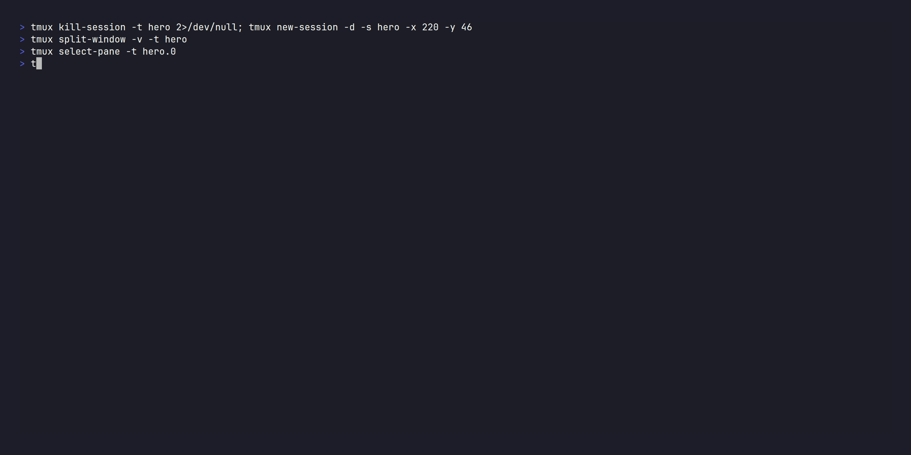

<!-- mcp-name: io.github.astrogilda/waitbus -->

# waitbus: the workstation-local, cross-harness status bus. D-Bus for agents, with a replay log and a wait primitive

[](https://github.com/astrogilda/waitbus/actions/workflows/ci.yml)
[](https://www.python.org/downloads/)
[](https://opensource.org/licenses/MIT)
[](https://deepwiki.com/astrogilda/waitbus)
[](https://context7.com/astrogilda/waitbus)

**One `wait` verb that blocks on, and queries across, every local source at once. When any agent, CI job, test, or container on your machine finishes or fails, every other tool on the box hears it: your Claude Code, your Cursor, your scripts, your CI. Clients that support server notifications get a push; the rest get one blocking `waitbus wait`. No waitbus cloud, no account, no telemetry; all processing stays on your machine.**

Below: a **Pydantic AI** agent and a **LangGraph** agent, two *different* frameworks running as two separate OS processes, both wait on one local waitbus bus. One fails; the peer on the *other* framework, plus a live `waitbus top` view, react to the single failure broadcast.



<sub>Real frameworks and real waitbus subscribe/emit; the agents' LLMs are deterministic fakes and the failure is an injected event, so the clip runs fully offline. Reproduce with <code>make hero</code>; higher-quality MP4 at <a href="docs/demo/.waitbus-demo/hero.mp4"><code>hero.mp4</code></a>. For a gentler start, see the single-agent <code>waitbus demo</code> in <a href="#try-it-in-60-seconds">Try it in 60 seconds</a>.</sub>

---

waitbus is the workstation-local, cross-harness status bus that lets the
tools on one machine hear each other. It does three things: ingest events,
broadcast them, and replay them.

**Ingest:** a blocking wait/emit primitive lets any agent or script
(across Cursor, Claude Code, and any tool on the box) wait on, or emit, events
from five built-in sources (GitHub Actions CI, pytest sessions, Docker
container lifecycle, filesystem changes, and Prometheus Alertmanager) plus any
plugin source registered under the `waitbus.sources.v1` entry-point group.

**Broadcast:** events land in SQLite the moment they arrive, and a broadcast
daemon fans each row to every connected consumer within about a
millisecond on the local socket (measured; see [benchmarks/BENCHMARKING.md](benchmarks/BENCHMARKING.md)). Your
agent blocks on `waitbus wait` (including across sources at once with
`--all-of`/`--first-of`) with zero agent-side polling and idle CPU until the thing it
cares about happens, and `waitbus on <predicate> -- <command>` runs a command
the moment it does (in the CLI process, not the daemon, via `execve` with no
shell; event values arrive as namespaced `WAITBUS_*` environment variables and
a `$WAITBUS_EVENT_FILE`, never as `argv`, so event content cannot inject flags
or overwrite `PATH`). Because every agent on the box shares that one bus, it
doubles as a same-machine coordination backplane: one agent emits, the others
wake.

**Replay:** a durable replay log (`since=`) means a consumer that was
offline catches up instead of missing the moment, and `waitbus events analyze`
queries what the bus stored. It is the local opt-in
event-broadcast model the OS already uses (D-Bus signals, inotify, journald),
with the replay log and a wait predicate added on top. (GitHub Actions was
the first source wired, which is why the examples lead with CI, but waitbus is
not CI-only.) The dependency stack is lean: `typer`, `msgspec`, `platformdirs`,
`pydantic-settings`, `prometheus_client`, `stamina`, and the `mcp` SDK, with no
heavy TUI or crypto dependency. The daemon idles at roughly 40 MB RSS measured
(p50 on the benchmark host, most of it the CPython interpreter baseline) over
a SQLite event store and an AF_UNIX `SOCK_STREAM` broadcast bus with
length-prefix framing. Runs on Linux (systemd-user) and macOS (launchd).

---

## Who this is for


**This is for you if…**

- **You run a heterogeneous agent fleet** (Claude Code *and* Cursor *and*
  background scripts) on one workstation and want them to hear each other's
  finishes and failures.
- **You wait across sources.** "Block until the tests pass *and* the build is
  done *and* CI is green," in one predicate, in a script
  (`waitbus wait --all-of ...`). Nothing else expresses this.
- **You want zero-LLM-token, zero-poll waiting** as a daily habit across many local
  things, and you'll run a daemon to get it.
- **You care that the daemon on your box is trustworthy:** reproducible
  builds, offline, no cloud, no account, no telemetry.

**This is NOT for you if…**

- **You wait on one GitHub repo's CI and nothing else.** Use `gh run watch`.
  It's zero-setup, and for that single job we don't beat it by enough to
  justify a daemon.
- **You only need to react to a file change.** Use `inotifywait`/`entr`.
  They're far faster on raw filesystem latency (our own benchmark says so) and
  need no daemon.
- **You want cloud, cross-machine, or team coordination.** Out of scope for
  the local core by design.
- **You want addressed agent-to-agent messaging as the product** (threads,
  inboxes, routing). The headline here is broadcast source-ingestion; the
  `request()`/`respond()` facet exists, but a dedicated message queue serves
  that center of gravity better.

---

## Try it in 60 seconds

```bash
uvx waitbus demo          # one command, no install needed
```


`waitbus demo` allocates a temporary state directory and boots the
broadcast daemon, then runs two phases. **Phase 1, the point:** an
agent blocks on `waitbus wait` (the same egress engine the real command
uses) with zero polling and idle CPU; the moment a github
`workflow_run` event lands, the wait returns and the demo prints the
real measured event-to-unblock latency. **Phase 2, breadth:** the same
primitive delivers every source. `pytest_session`, `docker_container`,
and `fs_change` events fan out to a live subscriber. Nothing on your
machine outside the temporary directory is touched.


A recorded MP4 + GIF walkthrough lives at
`docs/demo/.waitbus-demo/demo.mp4` and `demo.gif`
(the tape script is `demo.tape`). Re-rendering is reproducible
via `make demo` from that directory (requires
[VHS](https://github.com/charmbracelet/vhs) ≥ 0.10.0, `ttyd`, and
`ffmpeg`); the `Makefile` enforces the VHS version floor and refuses
to render against an older binary that could silently change tape
semantics.

> The four events the demo emits are synthesized in-process. There
> is no real HTTP listener, no real pytest run, no real Docker
> daemon, no real watchdog. A banner before each emit makes this
> explicit, mirroring the `waitbus stats` output. To wire
> waitbus against real GitHub webhook deliveries, follow the Quick
> start below.

---

## Quick start

```bash
uv tool install waitbus          # install the package
waitbus init                     # one-time setup: state dirs, SQLite schema, scaffold files
waitbus install-credentials github-webhook-secret   # optional: only for GitHub-CI waiting (enables the webhook listener)
waitbus install-systemd          # Linux: copy + enable the 8 systemd-user units
waitbus install-launchd          # macOS: copy + bootstrap the 4 LaunchAgent plists
waitbus read-events watch        # live tail of incoming events
```

`install-systemd` is Linux-only; `install-launchd` is macOS-only.
Each command refuses to run on the other platform and points at the
right one.

Once events are flowing, block any script or agent on the next
matching event with `waitbus wait` -- any source, any field, exit code
carries the verdict:

```bash
# pytest: wait for any session to finish (zero setup -- local source)
waitbus wait --source pytest --match 'fields.event_type="pytest_session"' --timeout 10m

# Docker: wait for a container to exit (zero setup -- local source)
waitbus wait --source docker --match 'fields.event_type="docker_container"' --timeout 30s

# Filesystem: wait for a watched path to change (zero setup -- local source)
waitbus wait --source fs --match 'fields.event_type="fs_change"' --timeout 5m

# GitHub CI: wait on a commit's terminal conclusion (needs webhook wiring -- see below)
waitbus wait --sha 7f3a1b2 --timeout 5m
```

If you have used [`watchexec`](https://github.com/watchexec/watchexec) or `entr` to
re-run a command when a file changes, `waitbus wait` is the same idea with a wider
net: it blocks on a file change too, but it can also wait on a CI run, a pytest
session, a container exit, or another agent's event, and hands the verdict back
through the exit code. The bus underneath also
fans every one of those events out to every other tool on the box.

---

## Architecture

[](docs/architecture.mmd)

<sub>Rendered from [`docs/architecture.mmd`](docs/architecture.mmd) (a static image is used so the diagram renders on PyPI and other non-Mermaid surfaces, not only on GitHub). Regenerate with `mmdc -i docs/architecture.mmd -o docs/architecture.png`.</sub>

Two ingress classes land events in the same store: **remote** webhooks (GitHub,
Alertmanager) arrive over HTTPS and pass through `waitbus listener serve`, while
**in-process** sources (pytest, docker, fs, plugins, and any agent) call the
public `emit()` API to write the row directly, with no listener and no network hop.
An ETag polling fallback runs on a 45-second timer for repos you cannot receive
webhooks for (upstreams, forks). Every path writes through the same
`INSERT OR IGNORE`, so redeliveries are idempotent, and every row rings the
broadcast doorbell so subscribers wake within about a millisecond regardless of which
ingress produced it.

How waitbus relates to MCP Tasks (`task=True`) and to the local agent-to-agent
buses (agent-message-queue, claude-code-inter-session): see
[`docs/COMPETITIVE_LANDSCAPE.md`](docs/COMPETITIVE_LANDSCAPE.md).

---

## Installation

### As a Python CLI tool

```bash
uv tool install waitbus              # or: pipx install waitbus
waitbus init                         # one-time setup: state dirs, SQLite schema, scaffold files
waitbus install-credentials github-webhook-secret   # optional: HMAC for the GitHub webhook listener (opt-in)
waitbus install-credentials alertmanager-hmac       # optional: alertmanager / watchdog HMAC
waitbus install-systemd              # Linux: copy + enable the 8 systemd-user units
waitbus install-launchd              # macOS: copy + bootstrap the 4 LaunchAgent plists
```

Each command is idempotent. Re-running `install-credentials <name>` rotates
the credential (re-configure the GitHub webhook and Alertmanager after
rotating, then `systemctl --user restart waitbus-listener.service`).

After install you have one console script on PATH: `waitbus`. All
daemon entry-points and admin commands are reachable via sub-commands:

| Sub-command | Purpose |
|-------------|---------|
| `waitbus init` | Bootstrap state dirs, SQLite schema, scaffold files |
| `waitbus install-systemd` | Linux: copy + enable systemd-user units |
| `waitbus install-launchd` | macOS: copy + bootstrap LaunchAgent plists |
| `waitbus install-credentials` | Stage an HMAC secret into the 0600 secrets file (reads `--file` or stdin) |
| `waitbus doctor` | Validate install (paths, binaries, credential store, units, /metrics) |
| `waitbus status` | Operational dashboard: DB row count, daemon liveness |
| `waitbus verify-plugin` | Validate `.claude-plugin/plugin.json` |
| `waitbus listener serve` | HTTP webhook receiver (loopback :9000) |
| `waitbus broadcast serve` | AF_UNIX broadcast hub daemon |
| `waitbus etag-poll run` | GitHub API ETag poll worker |
| `waitbus mcp serve` | MCP server (stdio) re-emitting broadcast events as notifications |
| `waitbus read-events watch` | Subscribe to broadcast bus, stream events live |
| `waitbus read-events list` | Print recent events from the local cache |
| `waitbus pr-monitor tick` | Roll job events into per-PR state |
| `waitbus watchdog-check run` | Ingestion-silence detector |

And, depending on platform, either 8 systemd-user units in `~/.config/systemd/user/` (Linux):

```
waitbus-listener.service    waitbus-broadcast.socket
waitbus-broadcast.service   waitbus-etag-poll.service
waitbus-etag-poll.timer     waitbus-watchdog.service
waitbus-watchdog.timer      waitbus-forward@.service
```

…or 4 LaunchAgent plists in `~/Library/LaunchAgents/` (macOS):

```
dev.waitbus.listener.plist     dev.waitbus.broadcast.plist
dev.waitbus.etag-poll.plist    dev.waitbus.watchdog.plist
```

The macOS plists carry `__BIN_DIR__` / `__LOG_DIR__` / `__RUNTIME_DIR__`
placeholders that `waitbus install-launchd` resolves to the
operator's actual paths before writing. Agents are loaded via
`launchctl bootstrap gui/$UID <plist>` (the modern replacement for
the deprecated `launchctl load -w`).

### As a Python library

```python
from waitbus import subscribe, wait_for, EventFrame

# Block until one matching event arrives (returns the frame, or None on timeout).
frame: EventFrame | None = wait_for('fields.event_type="pytest_session"',
                                    source="pytest", timeout=600)
if frame is not None:
    print(frame.event_type, frame.fields)

# Or stream every matching event as it lands.
for frame in subscribe(source="docker"):
    print(frame.event_type, frame.fields)
```

Agents can also message each other on the same bus -- one sends a request and
blocks for the correlated reply, the other answers from its inbox:

```python
from waitbus import request, respond, wait_for

# responder (agent_b), in its own process
msg = wait_for(to="agent_b", source="agent", timeout=5.0)
if msg is not None:
    respond(msg, '{"answer": 42}')             # sender defaults to msg's recipient

# requester (agent_a)
reply = request("agent_b", '{"ask": "meaning"}', sender="agent_a", timeout=5.0)
# reply is the answer EventFrame, or None on timeout.
```

See [`docs/AGENT_MESSAGING.md`](docs/AGENT_MESSAGING.md) for the request/reply
contract, the inbox stream, and the same-UID trust model.

The stable public API is `emit`, `subscribe`, `asubscribe`, `wait_for`,
`request`, `respond`, `EventFrame`, and the plugin hooks `register_source`,
`register_condition`, `register_evaluator` (full signatures in
[`docs/CONSUMER_API.md`](docs/CONSUMER_API.md)). To produce events, the
`waitbus emit` CLI is the simplest path; see `examples/emitters/` for the
`emit()` Python form. Everything under a leading underscore (`waitbus._db`,
`waitbus._paths`, …) is a private internal and may change between releases.

Runtime dependencies (the full mandatory set, same as the lean stack
above): `typer` (umbrella CLI), `msgspec` (wire framing), `platformdirs`
(state and runtime path resolution), `pydantic-settings` (config
loader), `prometheus_client` (metrics), `stamina` (retry policy), and
the `mcp` SDK (MCP server). The two consumer-facing extras
(`waitbus[analyze]`, `waitbus[fs]`) pull `duckdb` / `watchdog` lazily and
are the only optional packages. All other internal modules are pure
stdlib: no network at import time, no C extensions, safe to import
in any Python 3.11+ environment. The package root logger uses
`NullHandler` so library consumers never see leaked log records.

### As an MCP server (PyPI + uvx)

`waitbus mcp serve` is a stdio MCP server (JSON-RPC 2.0 over the spec at
https://modelcontextprotocol.io/specification). What a given client can do with it
depends on which MCP features that client implements, so here is the actual
capability split:

- **Pull, for any MCP client that supports Tools.** Call waitbus tools to query
  status and to block-wait for events; `tail_events` is a bounded long-poll, so
  even waiting needs no polling loop. This is the broadly portable path.
- **Push, for clients that support resource subscription.** waitbus emits the
  spec-standard `notifications/resources/updated` for `waitbus://repo/...`
  subscribers. Whether your client *surfaces* that push (rather than only
  calling tools) depends on the client; most coding-agent MCP clients today are
  pull-only, and the published client matrices track Tools / Resources / Prompts,
  not a notification-surfacing column.
- **Inline render, for Claude Code.** waitbus also emits an Anthropic-private
  `notifications/claude/channel` that Claude Code renders inline; other clients
  ignore the unknown method harmlessly per JSON-RPC 2.0.

**Verified with:** an executable test exercises the path end-to-end, not just
"speaks the spec": **Claude Code** (the MCP emit path, `tests/test_mcp_e2e.py`);
and, via the public Python SDK (`waitbus.wait_for` / `subscribe`), a
**Pydantic AI** and a **LangGraph** agent (`tests/test_agent_integration_*.py`);
plus the language snippets and the bash `waitbus wait` wrapper. Any other
stdio-MCP client can use the pull path above, but that is config, not a tested
end-to-end guarantee.

The command is always `uvx --from waitbus waitbus mcp serve`; only WHERE each client
stores its MCP config differs. Those locations and formats move across client
versions, so treat the table below as a starting point and check your client's
current MCP docs:

```json
{
  "mcpServers": {
    "waitbus": {
      "command": "uvx",
      "args": ["--from", "waitbus", "waitbus", "mcp", "serve"]
    }
  }
}
```

| Client | MCP config location (verify against the client's current docs) |
|---|---|
| Claude Code | `~/.claude/.mcp.json` (or per-project `./.mcp.json`) |
| Claude Desktop | `~/Library/Application Support/Claude/claude_desktop_config.json` (macOS) or `%APPDATA%\Claude\claude_desktop_config.json` (Windows) |
| Cursor | `~/.cursor/mcp.json` (or `.cursor/mcp.json` per project) |
| Cline (VS Code) | `~/.config/Cline/cline_mcp_settings.json` (Linux), or per-workspace `.vscode/cline_mcp_settings.json` |
| Codex CLI (OpenAI) | `~/.codex/config.toml` (under a `[mcp_servers.waitbus]` table; Codex uses TOML, not JSON) |
| Gemini CLI (Google) | `~/.gemini/settings.json` (under the `mcpServers` key) |
| Continue | `~/.continue/config.json` (under the `mcpServers` key) |

> **Aider** is intentionally absent: as of 2026-05 Aider ships **no native MCP
> client** (tracked upstream in aider-AI/aider FR #4506; the only MCP path is the
> separate AiderDesk companion app). Point Aider-style or non-MCP agents at waitbus
> through the Python SDK (`waitbus.wait_for`) or the `waitbus wait` CLI
> instead.

`uv` must be on PATH (`curl -LsSf https://astral.sh/uv/install.sh | sh`).
See [platform support](#platform-support).

### As a Claude Code plugin

```bash
claude --plugin-dir ~/.local/share/waitbus/plugin
```

Or use the marketplace entry once it is published to the MCP Registry (see
CHANGELOG.md for current status). The plugin enables `/waitbus` slash
commands and the `waitbus` skill inside any Claude Code session.

---

## Usage

### Reading events

```bash
# Live tail — one line per event; monitoring-friendly cadence
waitbus read-events watch

# Query the last hour in JSON (pass extra flags after the sub-command)
waitbus read-events list --since 1h --json

# Roll job events into per-PR state (watch PRs 7 and 9)
waitbus pr-monitor tick --pr 7 --pr 9
```

---

## Key features

- **Sub-second `workflow_job` failure detection.** Catches matrix-cell failures within sub-second of GitHub
  delivering the webhook (wall-clock from webhook receipt, not from the
  CI failure itself), with no waiting for the parent
  `workflow_run.completed` to arrive. Individual job failures surface
  immediately even when other matrix cells are still running.

- **SQLite event store with idempotent writes.** `INSERT OR IGNORE` on
  `event_id` (ULID, assigned at ingest time). Webhook redeliveries and
  ETag-poll duplicates are silently discarded; the DB stays consistent without
  a dedup queue.

- **AF_UNIX `SOCK_STREAM` broadcast bus with length-prefix framing.** Each
  wire frame is a 4-byte big-endian length followed by the JSON payload,
  portable across Linux and macOS (where `SOCK_SEQPACKET` is unavailable).
  Non-blocking sockets with per-subscriber lag counters; slow subscribers
  are closed after `LAG_LIMIT` consecutive drops and reconnect via
  EOF-triggered cursor reset.

- **HMAC-SHA256 webhook signature verification.** Secret staged once via
  `waitbus install-credentials github-webhook-secret` into a `0600`
  `secrets.json` under the user state directory, read at unit-start.
  Missing or invalid signatures are rejected with 401 before the payload
  is read.

- **SIGTERM drain guarantee.** The broadcast daemon stops accepting new
  subscribers on SIGTERM, drains all in-flight frames to connected subscribers,
  closes them with EOF, unlinks its socket files, and exits 0. No events are
  dropped on `systemctl restart waitbus-broadcast`.

- **ETag polling fallback.** A 45-second timer polls repos listed in
  `watched_repos.txt` using `If-None-Match` to avoid burning GitHub API rate
  limits. Coexists with webhook-driven repos.

- **Prometheus metrics endpoint.** `http://127.0.0.1:9000/metrics` exposes
  ingestion-event and ingestion-error counters in Prometheus text format. The
  watchdog timer detects and records ingestion silence.

---

## Configuration

**Config file (optional):** `~/.config/waitbus/config.toml`

```toml
[prometheus]
owner = "my-org"
repo  = "my-repo"
```

**Environment variable overrides:**

| Variable | Purpose |
|----------|---------|
| `WAITBUS_PROM_OWNER` | Override Prometheus alert label: owner |
| `WAITBUS_PROM_REPO` | Override Prometheus alert label: repo |
| `WAITBUS_STATE_DIR` | Override the state directory (SQLite DB, scaffolds, cursors). Default resolved via `platformdirs`. |
| `WAITBUS_RUNTIME_DIR` | Override the runtime directory (broadcast + doorbell AF_UNIX sockets). Default resolved via `platformdirs`. |

### State directory resolution

Path resolution lives in `waitbus._paths` and follows the same
first-hit-wins precedence as the rest of the config chain:

1. `WAITBUS_STATE_DIR` / `WAITBUS_RUNTIME_DIR` env vars (operator-controlled).
2. `platformdirs.PlatformDirs("waitbus")` per-platform defaults:
   - **Linux:** state at `~/.local/state/waitbus/` (honours `XDG_STATE_HOME`);
     sockets at `/run/user/$UID/waitbus/` (honours `XDG_RUNTIME_DIR`).
   - **macOS:** state at `~/Library/Application Support/waitbus/`;
     sockets at a stable `tempfile.gettempdir()`-derived path
     (platformdirs' macOS `user_runtime_dir` is Apple-evictable cache,
     unsuitable for AF_UNIX sockets).

The shipped systemd units use `StateDirectory=waitbus` and
`RuntimeDirectory=waitbus`, so on Linux systemd creates the
directories with 0700 ownership before the daemons start, so no
operator mkdir is required.

**Secrets** (staged via `waitbus install-credentials <name>`):

| Secret name | Required | Purpose |
|-------------|----------|---------|
| `github-webhook-secret` | Only with the webhook listener | HMAC secret for GitHub webhook signature verification |
| `alertmanager-hmac` | No | HMAC secret for Alertmanager / watchdog webhook verification |

The broadcast bus itself needs no secret: it is an AF_UNIX socket guarded by
the kernel's same-UID peer-credential check, so there is no subscriber token.
Secrets are stored in a single `0600`-mode `secrets.json` under the user
state directory (`<state_dir>/secrets.json`); `install-credentials` reads the
value from `--file` or stdin and merges it in with an atomic replace, never
exposing it on the command line. At-rest protection of the file is delegated
to the host's full-disk encryption (FileVault / LUKS); see
[SECURITY.md](SECURITY.md). `waitbus doctor` reports whether each required
key is present without printing its value, and exits 1 if a piece needed by
an enabled unit is missing.

---

## Security

See [SECURITY.md](SECURITY.md) for the full HMAC threat model, platform
assumptions, and vulnerability reporting process.

**Same-UID trust model.** The broadcast bus has no inter-process
confidentiality: any process running as your user can read every event on the
bus and can emit events under any sender name. waitbus is a single-user
workstation tool, not a security boundary between processes you run. Peer
authentication is by kernel-verified UID (`SO_PEERCRED`), so a *different* user
cannot connect, but same-user isolation is out of scope by design.

To verify the release artifacts:

```bash
gh attestation verify $(python -c "import waitbus; print(waitbus.__file__)") \
  --repo astrogilda/waitbus
```

See [SECURITY.md](SECURITY.md#verifying-release-artifacts) for the full
provenance verification procedure including SLSA, PEP 740, and SBOM checks.

---

## Support

For bug reports, feature requests, and questions, see
[SUPPORT.md](SUPPORT.md); it lists the security, abuse/conduct, and
general channels and sets single-maintainer, best-effort
expectations. Security vulnerabilities go through the private process in
[SECURITY.md](SECURITY.md), never a public issue.

---

## Operating

```bash
# Start the core daemons
systemctl --user start waitbus-listener.service
systemctl --user start waitbus-broadcast.socket

# Start the background timers
systemctl --user start waitbus-etag-poll.timer
systemctl --user start waitbus-watchdog.timer

# Health check — exits 1 on any missing required config or stopped unit
waitbus doctor

# Watch webhook deliveries arrive in real time
waitbus read-events watch
```

Enable units to start automatically on login:

```bash
systemctl --user enable waitbus-broadcast.socket \
    waitbus-etag-poll.timer waitbus-watchdog.timer
# The webhook listener is opt-in; `install-credentials github-webhook-secret` enables it.
```

Rotate the webhook HMAC secret:

```bash
# Pipe the new value in; install-credentials atomically replaces the staged secret.
openssl rand -hex 32 | waitbus install-credentials github-webhook-secret
# Then update the GitHub repository webhook secret and Alertmanager config.
systemctl --user restart waitbus-listener.service
```

---

### Headless server (SSH-only / no graphical session)

On a headless box without a graphical login session, two additional pieces are
required for the systemd-user instance to run continuously even when no
interactive session is open:

1. **Keep the user manager alive across logouts.** Run once:
   ```bash
   loginctl enable-linger <username>
   ```
   Without this, the systemd user manager and all its units stop when the last
   interactive session ends.

2. **No keyring unlock required.** Secrets live in a `0600` `secrets.json`
   under the user state directory, read with a plain file read, no keyring,
   no D-Bus session requirement, and no `pam_gnome_keyring.so` dependency, so
   the daemon stack runs unmodified on a fully headless box.

**Verifying the linger setting works.** Open a fresh SSH session (do NOT start
the units manually first) and run:

```bash
systemctl --user is-active waitbus-listener
```

The result should be `active`. If the unit is not active without a manual
`systemctl --user start`, the linger setting is not in effect.

**`XDG_RUNTIME_DIR` on linger-enabled hosts.** When linger is enabled,
systemd sets `XDG_RUNTIME_DIR=/run/user/$(id -u)` automatically and creates
the broadcast socket path beneath it. No operator action is required; the
path is available from the first `systemctl --user` call in any session.

---

## Wiring up repositories

**Local sources need no wiring.** pytest, Docker, and filesystem events are
produced on the box itself -- once the daemons are running (Quick start above),
`waitbus wait --source pytest|docker|fs` works with zero per-repo setup. The two
subsections below are only for GitHub CI, which arrives over a webhook and
therefore needs a forwarder.

**Event-driven (preferred for repos you own):**

```bash
gh webhook forward \
    --repo=<owner>/<repo> \
    --events=workflow_run,workflow_job \
    --url=http://127.0.0.1:9000/webhook \
    --secret="<the same plaintext value you piped to install-credentials>"
```

`gh webhook forward` creates an ephemeral GitHub-side webhook and tunnels
deliveries to the local listener. The secret must match the plaintext you
staged via `waitbus install-credentials github-webhook-secret`.

For a systemd-supervised forwarder (the shipped `waitbus-forward@.service`
template), no operator action is needed: the unit reads the
`github-webhook-secret` key from `secrets.json` (via `$STATE_DIRECTORY`) at
start and passes it to `gh webhook forward --secret`.

**ETag polling (repos you can read but cannot receive webhooks for):**

Append `owner/repo` lines to `watched_repos.txt` under the resolved
state directory (`waitbus doctor` prints the path; on Linux without
`WAITBUS_STATE_DIR` overrides, that is `~/.local/state/waitbus/watched_repos.txt`).
The 45-second timer picks them up automatically.

For SSH-only boxes, see [Headless server](#headless-server-ssh-only--no-graphical-session)
for the `loginctl enable-linger` requirement.

---

## Platform support

| Component | Linux + systemd | macOS + launchd | Notes |
|-----------|-----------------|-----------------|-------|
| Python listener | Yes | Yes | Loopback-bound, stdlib only |
| SQLite event store | Yes | Yes | Single-file DB, no server |
| Broadcast daemon | Yes | Yes | AF_UNIX SOCK_STREAM + length-prefix framing |
| Doorbell primitive | `os.eventfd` | SOCK_STREAM ping | Inline-dispatched at the bind site |
| Peer-credential UID check | `SO_PEERCRED` | `getpeereid()` via ctypes | LOCAL_PEERPID deliberately not used (see SECURITY.md) |
| Install entry | `waitbus install-systemd` | `waitbus install-launchd` | Each refuses to run on the other platform |
| Process supervisor | systemd-user units | launchd LaunchAgents | 8 systemd units, 4 launchd plists, all driven via `waitbus` |
| MCP server | Yes | Yes | stdio MCP, runs in any spec-compliant client |
| Claude Code plugin | Yes | Yes | Plugin manifest in `.claude-plugin/` |

Both platforms run the full daemon stack. Linux uses systemd-user units
with socket activation; macOS uses launchd LaunchAgents with manual
socket bind. The peer-credential UID check, doorbell primitive, and
install entry-point each dispatch inline at the leaf call site; there
is no `IPCBackend`-style abstraction layer, since those three leaf
sites are the only platform-divergent code.
Details in [SECURITY.md](SECURITY.md).

**Native Windows is not supported.** waitbus's trust model rests on an
AF_UNIX socket plus a `SO_PEERCRED` same-UID peer check, which has no
Win32 equivalent. Windows users run waitbus under **WSL2**, which is a real
Linux kernel: `pip install waitbus` (or `uv tool install waitbus`) inside a
WSL2 distribution works exactly as it does on native Linux. See
[docs/ARCHITECTURE.md](docs/ARCHITECTURE.md) for the platform rationale.

**Zero default egress, no telemetry.** The broadcast daemon, every
subscriber (`waitbus wait`, `waitbus read-events`, `waitbus mcp serve`), and
the `emit()` path make no outbound network calls; nothing is phoned
home. The only network surface is the **optional** inbound GitHub webhook
listener (loopback `127.0.0.1:9000`, HMAC-verified), plus local OS keyring
access for credential storage. Outbound traffic happens only when you
explicitly opt into the ETag polling fallback (which calls the GitHub API
for repos you list). See [SECURITY.md](SECURITY.md) for the full network
surface.

---

## Contributing

See [.github/CONTRIBUTING.md](.github/CONTRIBUTING.md) for the per-surface
dev guide, loading the plugin locally, version sync, and release flow.

---

## License

waitbus is released under the MIT License. See [LICENSE](LICENSE) for the full text.

## More

- [CHANGELOG.md](CHANGELOG.md): version history and migration notes
- [SECURITY.md](SECURITY.md): HMAC threat model, platform assumptions, reporting process
- [.github/CONTRIBUTING.md](.github/CONTRIBUTING.md): per-surface dev guide, loading the plugin locally
- [docs/emitters/recipes.md](docs/emitters/recipes.md): shell and docker emit recipes, plus the CloudEvents envelope mapping for external producers
- [docs/emitters/claude-code-hook.md](docs/emitters/claude-code-hook.md): emit a bus event on Claude Code session lifecycle hooks


